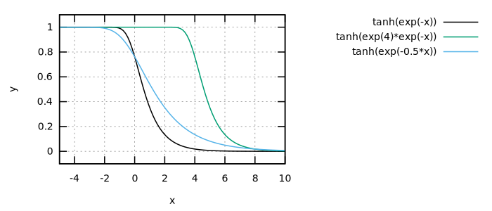
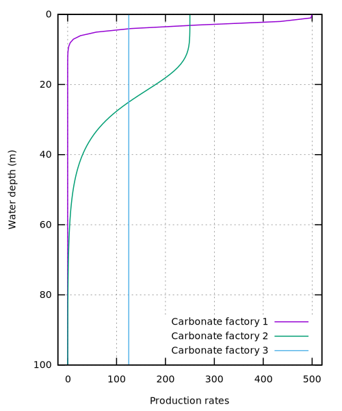

The paper by @Bosscher1992 is an early computer model for simulating reef growth. This paper contains some of the essential ingredients that we find back in CarboCAT. Here we will try to reproduce their results.

## Parameters

> - $G_m$ maximum growth rate. The maximum rate of reef growth is in the range of $10-15 {\rm mm\ yr^{-1}}$ (Macintyre etal., 1977; Adey, 1978; Davies, 1983).
> - $k$ extinction coefficient. This is a measure of the extinction of
> photosynthetically active radiation (PAR), i.e. light with a wavelength of
> 400-700 nm.  The value of k for oceanic waters ranges from $0.04$ to $0.16\ {\rm m^{-1}}$
> (Jerlov, 1976); reported values for reef waters also lie within this range
> (Brakel, 1979; Van den Hoek et al., 1975; Weinberg, 1976; Chalker, 1981 ;
> Porter, 1985).
> - $I_0$ surface light intensity. The light intensity at the water
> surface at midday in the tropics lies in the range of $2000-2250\ {\rm \mu E\ m^{-2}s^{-1}}$.
> - $I_k$ saturating light intensity. Light saturating intensities are in the range
> $50-450\ {\rm \mu E\ m^{-2}s^{-1}}$, depending on speciesand water depth (Chalker, 1981 ;Wyman et
> al., 1987). Photoadaptationof reef-building corals has not been taken into
> account. More generally, light does not become a limiting factor for coral
> growth until it reaches roughtly 10% of its surface value (B. E. Chalker, in
> Done, 1983).


``` {.gnuplot file=src/figures/bs92-fig2.gnuplot}
set term svg
set xrange [-100:2000]
set yrange [50:0]
set ylabel "depth (m)"
set xlabel "intensity"

set arrow from 20, 45 to 20, 0 nohead
set arrow from 20, 45 to 2000, 45 nohead

set parametric
set trange [0:50]
plot 2000*exp(-0.1 * t), t w l, \
     1400*tanh(2000*exp(-0.1*t) / 400), t w l
```

``` {.make #build target=data/fig/bs92-fig2.svg}
targets += $(fig)/bs92-fig2.svg

$(fig)/bs92-fig2.svg: src/figures/bs92-fig2.gnuplot
> @mkdir -p $(@D)
> gnuplot $< > $@
```

The growth rate is

$$g(w) = g_m {\rm tanh}\left({{I_0 e^{-kw}} \over {I_k}}\right),$$

where $w$ is the water depth in meters, $g_m$ is the maximum growth rate in ${\rm m}\ {\rm My}^-1$, $I_0$ is surface light intensity, $I_k$ is saturation light intensity, and $k$ is the extinction coefficient.

The water depth is a strange way of writing things down. Plots are upside down, growth in deposition should give shallower sea bed. BS92 write $(h_0 + h(t)) - (s_0 + s(t))$. Actually $s_0$ is best set to 0, or simply included into $s(t)$ and $h_0$ can be replaced with setting $h(t=0) = h_0$. Then, as we have the growth rate as a function of water depth $g(w)$, we can say

$$\partial_t h = -g_m {\rm tanh}(I_0 / I_k (\exp(-k (h - s(t))))).$$

``` {.julia file=src/BS92.jl}
module BS92

using DifferentialEquations
using CSV
using DataFrames
using Interpolations

function sealevel_curve()
     data = DataFrame(CSV.File("data/bs92-sealevel-curve.csv"))
     #scale(interpolate(data.depth, BSpline(Cubic())), LinRange(0.0, 80_000.0, 862))
     linear_interpolation(data.time, data.depth)
end

<<carbonate-production>>

struct Parameters
     I₀::Float64
     Iₖ::Float64
     k::Float64
     gₘ::Float64
end

g(p::Parameters, w) = g(p.gₘ, p.I₀, p.Iₖ, p.k, w)

function model(p::Parameters, s, t_end::Float64, h₀::Float64)
     ∂h(h::Float64, _, t::Float64) = -g(p, h - s(t))
     ode = ODEProblem(∂h, h₀, (0.0, t_end), Nothing)
     #solve(ode, AutoTsit5(Rosenbrock23()), reltol=1e-8, saveat=1000.0)
     solve(ode, Euler(), dt=10.0, reltol=1e-6, saveat=1000.0)
end

struct Scenario
     param::Parameters
     sealevel
     t_end::Float64
end

model(s::Scenario, h₀::Float64) = model(s.param, s.sealevel, s.t_end, h₀)

SCENARIO_A = Scenario(
     Parameters(2000.0, 250.0, 0.05, 0.005),
     sealevel_curve(),
     80_000.0)

SCENARIO_B = Scenario(
     Parameters(2000.0, 250.0, 0.05, 0.005),
     let sc = sealevel_curve()
          x -> sc(x) * 0.9
     end,
     80_000.0)

end
```

Finally, we can try to reproduce figure 8 in BS92. They show an input curve for $s(t)$ but give no functional description. The curve starts with a linear drop from 0 to 120m depth over a time of 20000 years, then slowly rises with $s(t) = a +  bt + A \sin(2\pi t / P)$, with a period $P = \sim 15-20 {\rm kyr}$, amplitude $A = \sim 40 {\rm m}$. It might be easiest to take a screenshot of the PDF and convert the graph into a table.

!include docs/fig/bs92-fig8.html

<details><summary>Plotting code</summary>

``` {.julia file=src/BS92/fig8-sealevel.jl}
using Images
using DataFrames
using CSV

function main()
    img = load("data/bs92-sealevel-input.png")
    img_gray = Gray.(img)
    signal = 1.0 .- channelview(img_gray)
    signal ./= sum(signal; dims=[1])
    (n_y, n_x) = size(signal)
    y = sum(signal .* (1:n_y); dims=[1]) / n_y * 200.0
    df = DataFrame(
        time = LinRange(0.0, 80_000.0, n_x),
        depth = y[1, :])
    CSV.write("data/bs92-sealevel-curve.csv", df)
end

main()
```

``` {.julia file=src/BS92/fig8.jl}
using MindTheGap.BS92
using Plots

function main()
     h0 = LinRange(0, 200, 101)
     result = hcat([BS92.model(BS92.SCENARIO_A, h).u for h in h0]...)
     t = LinRange(0, 80_000, 81)

     plotlyjs()

     plot(h0, result',
          xaxis=("initial depth (m)"),
          yaxis=("depth (m)", :flip),
          legend_position=:none, lc=:steelblue,
          size=(700, 700), fontfamily="Merriweather,serif")

     plot!(t, BS92.SCENARIO_A.sealevel(t),
          title="sea level curve", titlelocation=:left,
          titlefontsize=12,
          xaxis=("time (years)"),
          yaxis=("depth (m)", :flip),
          guidefontsize=10,
          legend_position=:none,
          lc=:steelblue,
          inset=(1, bbox(0.11, 0.60, 0.45, 0.28)),
          subplot=2,
          framestyle=:box)

     savefig("docs/fig/bs92-fig8.html")
end
```

</details>

## Carbonate production in CarboCAT

In CarboCAT some paramaters are estimated a bit different from BS92.

| parameter | reasonable (BS92) | estimate (Burgess2013) |
|---|---|---|
| $g_m$ | $10-15\ {\rm mm}\ {\rm y}^{-1}$ | $500, 400, 100\ {\rm m}\ {\rm My}^{-1}$ |
| $I_0$ | $2000-2250$ | $2000\ {\rm \mu E}\ {\rm m}^{-2}\ {\rm s}^{-1}$ |
| $I_k$ | $50-450$ | $300\ {\rm \mu E}\ {\rm m}^{-2}\ {\rm s}^{-1}$ |
| $k$ | $0.04-0.16\ {\rm m}^{-1}$ | $0.8, 0.1, 0.005$ no unit given |

Each species in the CA produces a form of carbonate. We may assume a one-to-one correspondence between coral species and a carbonate type (lythofacies). The assumption is made that the carbonate production depends on the water depth as (Bosscher and Schlager 1992),

$$g = g_m {\rm tanh}\left({{I_0 e^{-kw}} \over {I_k}}\right),$$

where $w$ is the water depth in meters, $g_m$ is the maximum growth rate in ${\rm m}\ {\rm My}^-1$, $I_0$ is surface light intensity, $I_k$ is saturation light intensity, and $k$ is the extinction coefficient.

``` {.julia #carbonate-production}
g(gₘ, I₀, Iₖ, k, w) = if w > 0.0
     gₘ * tanh(I₀/Iₖ * exp(-w * k))
else
     0.0
end
```

The maximum growth rate should be on the order of a centimeter per year. That would translate to 10m in a millenium and 10km in a million years. Why are these values off by so much? The same goes for the extinction coefficient. $I_0 / I_k$ is collected into a rate constant of about $6.7$. The growth rate still has to be converted into a carbonate accumulation, which should be much smaller due to compression and what not. There is a mistake in BS1992 equation 5, there should be brackets around $[h_0 + h(t)] - [s_0 + s(t)]$.

To understand, the shape of the production rate as a function of depth looks like this:



Notice that the numbers inside the exponential need to be unit-free, so does the output. The value of $\tanh \circ \exp$ at a depth of 0 is $0.7615\dots$. This does not make much sense, as I believe we should start at a value of 1 at the surface. By setting $I_0 / I_k$ to some value $>1$ this can be alleviated, but it changes the interpretation of the constants a little. The idea is that above a certain insolation, light is not the limiting factor to the rate of photosynthesis.

To reproduce Figure 2 in B13, I had to change the values for $g_m$ to 500, 250, and 125 respectively, the other values from Table 2 remained the same. I guess this was done for illustration purposes.



<details><summary>Plotting code</summary>

``` {.gnuplot file=src/figures/plot-tanh.gnuplot}
set term svg size 700, 300 font "sans serif, 14" linewidth 1.5
set xrange [-5:10]
set yrange [-0.1:1.1]
set grid
set key outside
set xlabel "x"
set ylabel "y"
plot tanh(exp(-x)) lc rgb 'black', tanh(exp(4)*exp(-x)), tanh(exp(-0.5*x))
```

``` {.gnuplot file=src/figures/burgess2013-fig2.gnuplot}
set term svg size 500, 600 font "sans serif,14" linewidth 1.5
set trange [0:100]
set yrange [100:0]
set xrange [-20:520]
set parametric
set key right bottom
set grid
set ylabel "Water depth (m)"
set xlabel "Production rates"
plot 500*tanh(6.7 * exp(-0.8 * t)), t title 'Carbonate factory 1', \
     250*tanh(6.7 * exp(-0.1 * t)), t title 'Carbonate factory 2', \
     125*tanh(6.7 * exp(-0.005 * t)), t title 'Carbonate factory 3'
```

``` {.make .build-artifact #plot-tanh}
.RECIPEPREFIX = >
.PHONY: all

all: docs/fig/burgess2013-fig2.svg docs/fig/tanh.svg

docs/fig/burgess2013-fig2.svg: src/figures/burgess2013-fig2.gnuplot
> @mkdir -p $(@D)
> gnuplot $< > $@

docs/fig/tanh.svg: src/figures/plot-tanh.gnuplot
> @mkdir -p $(@D)
> gnuplot $< > $@
```

</details>

