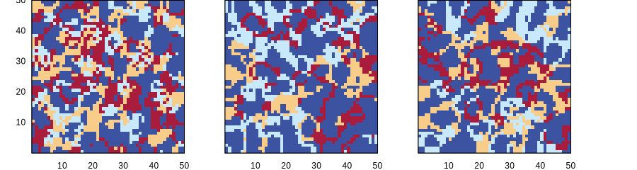
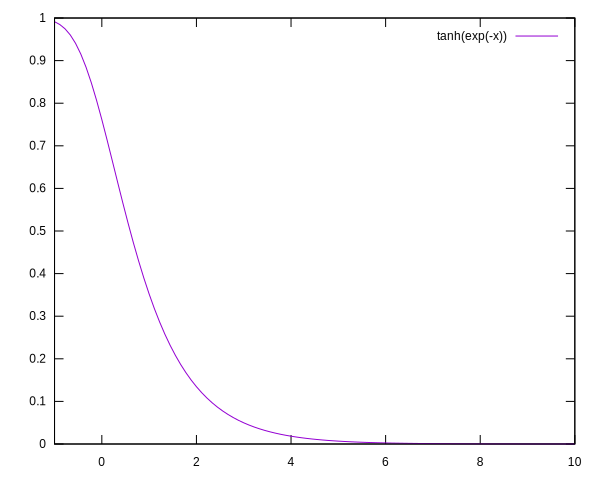
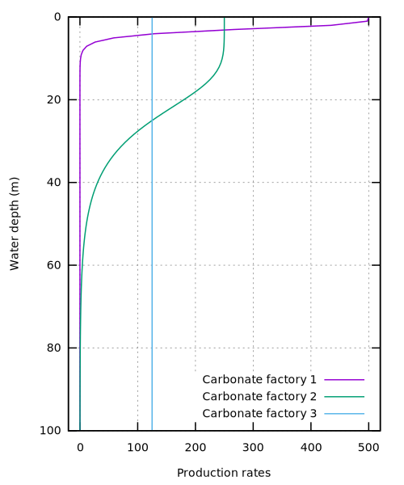

# CarboCAT
CarboCAT is primarily based on a very simple cellular automaton (CA). We may explore this CA as a first step in implementing the model in Julia.

``` {.julia file=src/Burgess2013.jl}
module Burgess2013

include("Burgess2013/Config.jl")
include("Burgess2013/CA.jl")
include("Burgess2013/Production.jl")

end
```

``` {.julia file=src/Burgess2013/Config.jl}
module Config

struct Species
    viability_range::Tuple{Int, Int}
    activation_range::Tuple{Int, Int}

    maximum_growth_rate::Float64
    extinction_coefficient::Float64
    saturation_intensity::Float64
end

Iₖ(s::Species) = s.saturation_intensity
k(s::Species) = s.extinction_coefficient
gₘ(s::Species) = s.maximum_growth_rate

end
```

## Cellular Automaton
The paper talks about cycling the order of preference for occupying an empty cell at each iteration. This means that the rules change slighly every iteration.

``` {.julia #cycle-permutation}
cycle_permutation(n_species::Int) =
    (circshift(1:n_species, x) for x in Iterators.countfrom(0))
```

The `stencil` function has an `args...` variadic arguments that are forwarded to the given rule. This means we can create a `rules` function that we pass the preference order as a second argument.

``` {.julia #burgess2013-rules}
function rules(neighbourhood::Matrix{Int}, order::Vector{Int})
    cell_species = neighbourhood[3, 3]
    neighbour_count(species) = sum(neighbourhood .== species)
    if cell_species == 0
        for species in order
            n = neighbour_count(species)
            if 6 <= n && n <= 10
                return species
            end
        end
        0
    else
        n = neighbour_count(cell_species) - 1
        (4 <= n && n <= 10 ? cell_species : 0)
    end
end

```

This function is not yet adaptible to the given rule set. Such a modification is not so hard to make. 

The paper talks about a 50x50 grid initialized with uniform random values.

``` {.julia file=src/Burgess2013/CA.jl}
module CA

using MindTheGap.Stencil

<<cycle-permutation>>
<<burgess2013-rules>>

function run(::Type{B}, init::Matrix{Int}, n_species::Int) where {B <: Boundary{2}}
    Channel{Matrix{Int}}() do ch
        target = Matrix{Int}(undef, size(init))
        put!(ch, init)
        stencil_op = stencil(Int, B, (5, 5), rules)
        for perm in cycle_permutation(n_species)
            stencil_op(init, target, perm)
            init, target = target, init
            put!(ch, init)
        end
    end
end

end
```

First, let us reproduce Figure 3 in Burgess 2013.


By eye comparison seems to indicate that this CA is working the same. I'm curious to the behaviour after more iterations. Let's try 10, 100, 1000 and so on.



The little qualitative change between 100 and 1000 iterations would indicate that this CA remains "interesting" for a long time.

On my laptop I can run about 150 iterations per second with current code. When using periodic boundaries, I get to 1500 iterations per second, which is peculiar. A lot can still be optimized.

<details><summary>Plotting code</summary>

``` {.julia file=src/figures/ca.jl}
using MindTheGap.Burgess2013.CA
using MindTheGap.Stencil: Reflected
using MindTheGap.Utility
using GnuplotLite

function plot_array(w::Int, h::Int, msgs; xtics="set xtics", ytics="set ytics")
    ch = Channel{String}() do ch
        g = Gnuplot(ch)

        top_margin = 0.002
        bottom_margin = 0.1
        left_margin = 0.05
        right_margin = 0.05
        inner_margin = 0.02
        vert_inner_margin = 0.025

        # h * ph + (h-1) * inner_margin + top_margin + bottom_margin = 1
        plot_height = (1.0 - (h-1)*inner_margin - top_margin - bottom_margin) / h
        plot_width = (1.0 - (w-1)*vert_inner_margin - left_margin - right_margin) / w

        g |> send("set multiplot; unset xtics")
        for (i, msg) in enumerate(msgs)
            grid_x = (i - 1) % w
            grid_y = (i - 1) ÷ w
            if grid_x == 0
                tmargin = 1.0 - top_margin - (plot_height + vert_inner_margin) * grid_y
                bmargin = tmargin - plot_height
                g |> send("set tmargin at screen $(tmargin); set bmargin at screen $(bmargin)")
                g |> send(ytics)
            end
            if grid_x == 1
                g |> send("unset ytics")
            end
            if grid_y == h-1 && grid_x == 0
                g |> send(xtics)
            end
            lmargin = left_margin + (plot_width + inner_margin) * grid_x
            rmargin = lmargin + plot_width
            g |> send("set lmargin at screen $(lmargin); set rmargin at screen $(rmargin)")
            g |> msg
        end
        g |> send("unset multiplot")
    end

    send(join(ch, "\n"))
end

function plot(output::String)
    init = rand(0:3, 50, 50)
    result = Iterators.take(CA.run(Reflected{2}, init, 3), 8)

    gnuplot() do g
        g |>
            send("set term svg size 900, 440") |>
            send("set output '$(output)'") |>
            send("load 'data/blue-to-red.pal'") |>
            send("set size square") |>
            send("set xrange [0:50]; set yrange [0:50]") |>
            send("unset colorbox") |>
            plot_array(4, 2, (send("data" => r) *
                              send("plot \$data matrix u (\$1+0.5):(\$2+0.5):3 t'' w image pixels")
                              for r in result);
                       xtics="set xtics 10, 10, 50",
                       ytics="set ytics 10, 10, 50")
    end
end

function plot_long_times(output::String)
    init = rand(0:3, 50, 50)
    result = select(CA.run(Reflected{2}, init, 3), [10, 100, 1000])

    gnuplot() do g
        g |>
            send("set term svg size 900, 240") |>
            send("set output '$(output)'") |>
            send("load 'data/blue-to-red.pal'") |>
            send("set size square") |>
            send("set xrange [0:50]; set yrange [0:50]") |>
            send("unset colorbox") |>
            plot_array(3, 1, (send("data" => r) *
                              send("plot \$data matrix u (\$1+0.5):(\$2+0.5):3 t'' w image pixels")
                              for r in result);
                       xtics="set xtics 10, 10, 50",
                       ytics="set ytics 10, 10, 50")
    end
end
```

``` {.make .build-artifact #make-burgess-fig3}
.RECIPEPREFIX = >
.PHONY: all
fig := docs/fig

all: $(fig)/burgess2013-fig3.svg $(fig)/burgess2013-long-times.svg

docs/fig/burgess2013-fig3.svg: src/figures/ca.jl
> julia --project=. -e 'include("$<"); plot("$@")'

docs/fig/burgess2013-long-times.svg: src/figures/ca.jl
> julia --project=. -e 'include("$<"); plot_long_times("$@")'
```

</details>

## Carbonate production
Each species in the CA produces a form of carbonate. We may assume a one-to-one correspondence between coral species and a carbonate type (lythofacies). The assumption is made that the carbonate production depends on the water depth as (Bosscher and Schlager 1992),

$$g = g_m {\rm tanh}\left({{I_0 e^{-kw}} \over {I_k}}\right),$$

where $w$ is the water depth in meters, $g_m$ is the maximum growth rate in ${\rm m}\ {\rm My}^-1$, $I_0$ is surface light intensity, $I_k$ is saturation light intensity, and $k$ is the extinction coefficient.

``` {.julia #carbonate-production}
g(gₘ, I₀, Iₖ, k, w) = gₘ * tanh(I₀/Iₖ * exp(-w * k))
```

> (from BS1992)
>
> - $G_m$ maximum growth rate. The maximum rate of reef growth is in the range of lO-lSrnmyr-' (Macintyre etal., 1977; Adey, 1978; Davies, 1983).
> - $k$ extinction coefficient. This is a measure of the extinction of
> photosynthetically active radiation (PAR), i.e. light with a wavelength of
> 400-700 nm.  The value of k for oceanic waters ranges from 0.04 to 0.16 m-'
> (Jerlov, 1976); reported values for reef waters also lie within this range
> (Brakel, 1979; Van den Hoek et al., 1975; Weinberg, 1976; Chalker, 1981 ;
> Porter, 1985).
> - $I_0$ surface light intensity. The light intensity at the water
> surface at midday in the tropics lies in the range of 2000-2250 pE m-* s - I .
> - $I_k$ saturating light intensity. Light saturating intensi- ties are in the range
> 50-450 $\mu E$ m-' s - ',depending on speciesand water depth (Chalker, 1981 ;Wyman et
> al., 1987). Photoadaptationof reef-building corals has not been taken into
> account. More generally, light does not become a limiting factor for coral
> growth until it reaches roughtly 10% of its surface value (B. E. Chalker, in
> Done, 1983).


| parameter | reasonable (BS92) | estimate (Burgess2013) |
|---|---|---|
| $g_m$ | $10-15\ {\rm mm}\ {\rm y}^{-1}$ | $500, 400, 100\ {\rm m}\ {\rm My}^{-1}$ |
| $I_0$ | $2000-2250$ | $2000\ {\rm \mu E}\ {\rm m}^{-2}\ {\rm s}^{-1}$ |
| $I_k$ | $50-450$ | $300\ {\rm \mu E}\ {\rm m}^{-2}\ {\rm s}^{-1}$ |
| $k$ | $0.04-0.16\ {\rm m}^{-1}$ | $0.8, 0.1, 0.005$ no unit given |

The maximum growth rate should be on the order of a centimeter per year. That would translate to 10m in a millenium and 10km in a million years. Why are these values off by so much? The same goes for the extinction coefficient. $I_0 / I_k$ is collected into a rate constant of about $6.7$. The growth rate still has to be converted into a carbonate accumulation, which should be much smaller due to compression and what not. There is a mistake in BS1992 equation 5, there should be brackets around $[h_0 + h(t)] - [s_0 + s(t)]$.

To understand, the shape of the production rate as a function of depth looks like this:



Notice that the numbers inside the exponential need to be unit-free, so does the output. The value of $\tanh \circ \exp$ at a depth of 0 is $0.7615\dots$. This does not make much sense, as I believe we should start at a value of 1 at the surface. By setting $I_0 / I_k$ to some value $>1$ this can be alleviated, but it changes the interpretation of the constants a little. The idea is that above a certain insolation, light is not the limiting factor to the rate of photosynthesis.

To reproduce Figure 2 in B13, I had to change the values for $g_m$ to 500, 250, and 125 respectively, the other values from Table 2 remained the same. I guess this was done for illustration purposes.



<details><summary>Plotting code</summary>

``` {.gnuplot file=src/figures/plot-tanh.gnuplot}
set term svg size 700, 300 font "sans serif, 14" linewidth 1.5
set xrange [-5:10]
set yrange [-0.1:1.1]
set grid
set key outside
set xlabel "x"
set ylabel "y"
plot tanh(exp(-x)) lc rgb 'black', tanh(exp(4)*exp(-x)), tanh(exp(-0.5*x))
```

``` {.gnuplot file=src/figures/burgess2013-fig2.gnuplot}
set term svg size 500, 600 font "sans serif,14" linewidth 1.5
set trange [0:100]
set yrange [100:0]
set xrange [-20:520]
set parametric
set key right bottom
set grid
set ylabel "Water depth (m)"
set xlabel "Production rates"
plot 500*tanh(6.7 * exp(-0.8 * t)), t title 'Carbonate factory 1', \
     250*tanh(6.7 * exp(-0.1 * t)), t title 'Carbonate factory 2', \
     125*tanh(6.7 * exp(-0.005 * t)), t title 'Carbonate factory 3'
```

``` {.make .build-artifact #plot-tanh}
.RECIPEPREFIX = >
.PHONY: all

all: docs/fig/burgess2013-fig2.svg docs/fig/tanh.svg

docs/fig/burgess2013-fig2.svg: src/figures/burgess2013-fig2.gnuplot
> @mkdir -p $(@D)
> gnuplot $< > $@

docs/fig/tanh.svg: src/figures/plot-tanh.gnuplot
> @mkdir -p $(@D)
> gnuplot $< > $@
```

</details>

``` {.julia file=src/Burgess2013/Production.jl}
module Production

using ..Config: Species, Iₖ, k, gₘ

<<carbonate-production>>

function production_rate(I₀::Float64, s::Species, w::Float64)
    g(gₘ(s), I₀, Iₖ(s), k(s), w)
end

function production_rate(I₀::Float64, specs::Vector{Species}, spec_map::Matrix{Int}, w::Matrix{Int})
    production_rate.(I₀, Iterators.map(i -> specs[i], spec_map), w)
end

end
```

### Crowding
In crowded areas carbonate production rates are reduced. For cells where

$$n_{min} \le n \le n_{opt}$$

and

$$n_{opt} \le n \le n_{max}$$

($n_{min}$ and $n_{max}$ for living cells are 4 and 10)

we have a linear increase and linear decrease of production rate (i.e. a triangle function).

## Transport
The sediment that is produced is distributed into lower lying neighbour cells that are not occupied by a producer. A user defined fraction of sediment from a producer is transported, first divided equally to lower neighbours, cascading to its neighbours by splitting in half and so on. The cascade stops when the sediment reaches a minimal threshold.

Thus, this step has two free parameters: the transported fraction of produced carbonate and the lower threshold.

Apparent from the illustration in B13 Figure 4, a 8-cell neighbourhood is used. Nothing is mentioned about the order in which the transport is computed. We may tag transported sediment with a bit flip and assign a new lythofacies to transported sediment.

## Subsidence
Subsidence refers to gradual lowering or lifting of the underlying floor bed. This could be either sea level rise due to climate change, but also tectonic activity. Sea level also changes according to a given recipe with say three sinusoidals (e.g. Milankovich cycles). When a cell gets "subaerial exposure", i.e. the water level drops below the cell elevation (stupid jargon), accumulation stops and the cell becomes dormant. On reflooding, the cell resumes activity. From the text it is not entirely clear, but I think deactivated cells don't take part in the CA, so they count as dead neighbours.

- [reference on accommodation](http://strata.uga.edu/sequence/accommodation.html), also links to a model called [SedFlux](https://github.com/mcflugen/sedflux).

$$T + E = S + W$$

Saying Tectonic subsidence plus Eustatic sea-level change equals Sedimentation plus change in Water depth.


## Steps

1. Update waterdepth, given subsidence
2. Update sea level elevation, given eustatics
3. Run CA
4. Compute thickness of carbonate production
5. Compute sediment transport

We need to keep a state with the following components:

- height map
- species
- global time, implying:
  - sea level and subsidence

Every cycle we may export a layer of sediment to archive.

